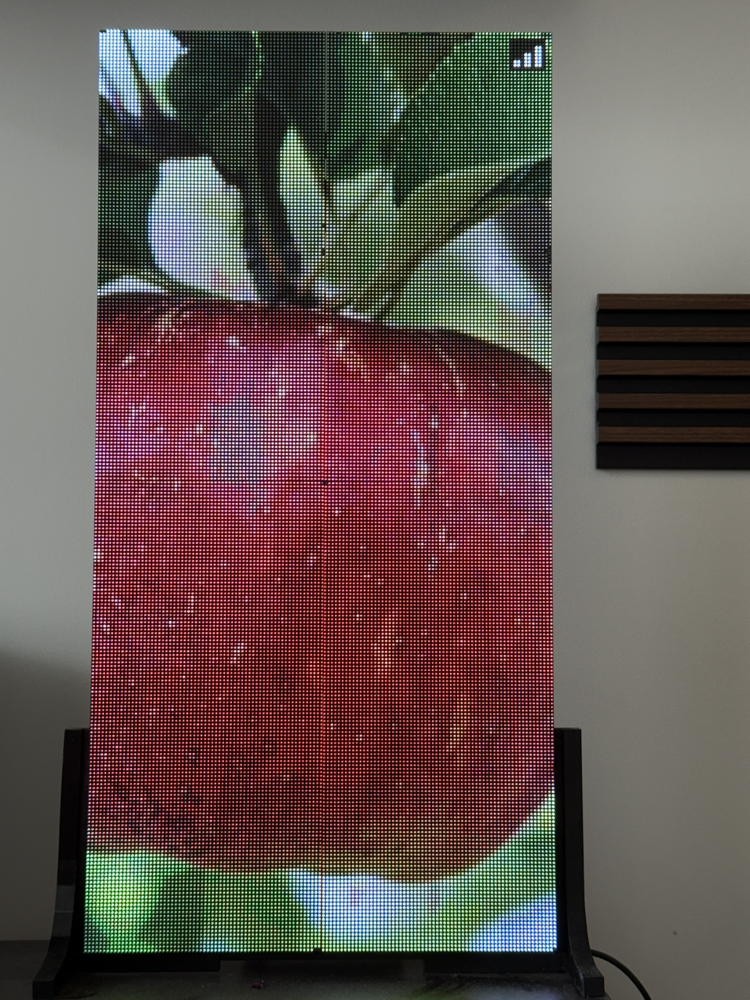
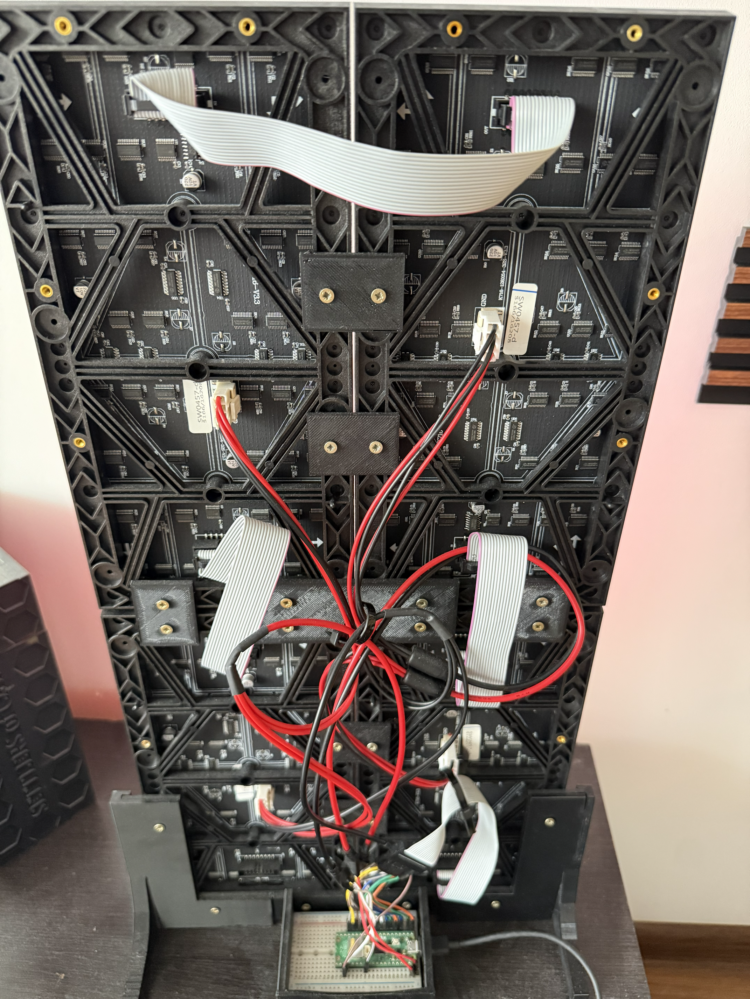

# HUB75 Multi-Panel WiFi Controller

<table>
  <tr>
    <td width="50%">
      
    </td>
    <td width="50%">
      A Raspberry Pi Pico 2 W controller for a 128x256 HUB75 LED display made from four daisy-chained 64x128 panels, with animation playback and live image uploads over WiFi/TCP. This README covers the hardware build, usage, roadmap, and internal architecture.
      <br><br>
      <a href="readmeAssets/WalkInTheForest.mp4">Watch the display demo (MP4)</a>
      <br><br>
      <strong>NOTE: The wave-like color artifacts in the video are caused by the interaction between the panel's refresh method and the camera's shutter. They are not visible in person; the display looks closer to the still Apple image.</strong>
    </td>
  </tr>
</table>

## Table of Contents

- [1. Overview](#1-overview)
  - [What This Project Is](#what-this-project-is)
  - [Project Motivation](#project-motivation)
  - [Forked From](#forked-from)
  - [Hardware Used](#hardware-used)
  - [What It Does](#what-it-does)
  - [Ways to Get Content Onto the Panel](#ways-to-get-content-onto-the-panel)
- [2. Hardware / Wiring](#2-hardware--wiring)
  - [Faulty HUB75 Connector Byte-Reorder Quirk](#faulty-hub75-connector-byte-reorder-quirk)
- [3. Usage](#3-usage)
  - [WiFi connection](#wifi-connection)
  - [Build & Flash Quickstart](#build--flash-quickstart)
  - [USE_ANIMATION flag](#use_animation-flag)
  - [Flashing Your Own Image or Animation](#flashing-your-own-image-or-animation)
  - [Python Utility Setup](#python-utility-setup)
  - [Uploading an Image Over TCP](#uploading-an-image-over-tcp)
- [4. Future Plans](#4-future-plans)
  - [Save TCP-Uploaded Image to Flash](#save-tcp-uploaded-image-to-flash)
  - [Flash-Backed Animation Upload Over TCP](#flash-backed-animation-upload-over-tcp)
  - [External Storage for Longer Animations](#external-storage-for-longer-animations)
- [5. Implementation Details / Architecture](#5-implementation-details--architecture)
  - [Program Flow](#program-flow)
  - [Driver Overview](#driver-overview)
  - [WiFi State Machine](#wifi-state-machine)
- [6. Credits / License](#6-credits--license)
  - [Attribution](#attribution)
  - [License](#license)

# 1. Overview

## What This Project Is
This project provides a driver for the Raspberry Pi Pico 2 W that drives a HUB75 LED panel. It can flash a still image or short animation directly into firmware, and once running, the Pico connects to WiFi and exposes a TCP listener, so a simple Python script can push a new image to the display at runtime, no reflash required.

## Project Motivation
The main goal was to build an affordable HUB75 display controller around the Raspberry Pi Pico 2 W. It offers a low-cost alternative to more powerful display-controller hardware while still driving multiple panels, playing animations, and receiving images over WiFi.

## Forked From
This project builds on the DMA/PIO based HUB75 driver from [JuPfu/hub75](https://github.com/JuPfu/hub75). The panel-driving core (DMA/PIO/BCM) is inherited from there; this fork adds multi-panel daisy-chain sync, animation playback, WiFi, and TCP-based image upload on top.

## Hardware Used
The microcontroller is a Raspberry Pi Pico 2 W. Earlier iterations used a Pico 1 W, but limited RAM and flash forced the move to the 2 W. The display is 4 daisy-chained 64x128 P2 panels, driven as one synchronized 128x256 canvas.

## What It Does
On boot, the panel displays whatever image or animation was baked into flash at build time. Once connected to WiFi (indicated by white wifi icon in top right corner of the panel), it can receive a new image over TCP at any time - the Python upload script sends a frame, and the panel updates it live, no reflash or reboot needed.

## Ways to Get Content Onto the Panel
Three Python scripts handle content:
- `imageToRGB888ArrayConverter.py` / `mp4ToRGB888ArrayConverter.py` - convert an image or video into a C header with a byte array, included via `defines.h` under the `USE_ANIMATION` flag. This becomes the default image/animation flashed into firmware.
- `sendImageOverTCP.py` - uploads a new image to the running Pico over TCP, replacing what's on screen without reflashing.

All three are configurable via defines at the top of the script or command-line arguments.
# 2. Hardware / Wiring

<table>
  <tr>
    <td width="50%">
      
    </td>
    <td width="50%">
      <strong>NOTE: This photo shows the wiring and construction used in my working setup and is provided for reference only. You may need to adapt it to your own panels and hardware.</strong>
      <br><br>
      Pin mapping / wiring config lives in <a href="HUB75DriverSrc/src/hub75.hpp">HUB75DriverSrc/src/hub75.hpp</a>. Pins can be changed by editing the defines there, but must follow the rules noted in the comments above each define (e.g. color/row-select pins must be consecutive).
    </td>
  </tr>
</table>

## Faulty HUB75 Connector Byte-Reorder Quirk
The display panels used for this project have a HUB75 connector with incorrect physical color annotations. To compensate, a software-side byte-reorder workaround lives in `RenderLogicalImageToGraphics()` and `DecodeAndStorePixel()`. If your panel doesn't have this quirk, it can be removed/changed by setting the `IMAGE_*_BYTE_OFFSET` defines back to regular RGB ordering (RED=0, GREEN=1, BLUE=2).

# 3. Usage

## WiFi connection
Copy `.env.example` to `.env` in the repository root, then replace every placeholder with your local settings.

- `PICO_IP` - Pico's current LAN address, used by the Python upload script only.
- `PICO_PORT` - TCP image-upload port. CMake gives this value to the firmware listener, and the Python upload script connects to the same port.
- `WIFI_SSID` - WiFi network name compiled into the firmware.
- `WIFI_PASSWORD` - WiFi password compiled into the firmware.
- `WIFI_GATEWAY_PROBE_PORT` - gateway health-check port used by the firmware

CMake generates `build/generated/networkConfig.h` from `.env`. Do not edit or commit that generated file; a normal build recreates it when it is missing or when `.env` changes. The Python upload script reads `PICO_IP` and `PICO_PORT` directly from the same `.env` file.

If wrong credentials are provided, the connection fails, the WiFi icon in the top right corner shows red, and only the default flashed image/animation is shown - with no way to update it over TCP.

## Build & Flash Quickstart
Configure `.env` as described above before the first build. This project is built and flashed using VS Code with the [Raspberry Pi Pico extension](https://marketplace.visualstudio.com/items?itemName=raspberry-pi.raspberry-pi-pico). Import the project through the extension, then use its UI buttons to compile and run/flash - no manual CLI setup required.

## USE_ANIMATION flag
The `USE_ANIMATION` flag in `src/defines/defines.h` controls what gets built into flash: `0` builds a single still image, `1` builds a multi-frame animation.

## Flashing Your Own Image or Animation
1. Run `imageToRGB888ArrayConverter.py` (still image) or `mp4ToRGB888ArrayConverter.py` (video/animation), pointing it at your source file and adjusting settings like animation delay/fps as needed.
2. The script generates a `.h` file in `imagesVideos/`.
3. `#include` that new file in `src/defines/defines.h` under the `USE_ANIMATION` block - that's the only required change.

## Python Utility Setup
Install the Python packages used by the image, video, and TCP upload scripts:

```sh
python -m pip install -r utilityScripts/requirements.txt
```

## Uploading an Image Over TCP
1. After flashing, the default image/animation should be visible with a small white WiFi icon in the top right corner, confirming the Pico is connected (also checkable in your router's admin panel).
2. Look up the Pico's IP address from your router.
3. Update `PICO_IP` in `.env` if the address differs from the value used during setup. Keep `PICO_PORT` equal to the firmware upload-listener port.
4. Set your image path (`IMAGE_PATH`) in `utilityScripts/sendImageOverTCP.py`, then run the script.
5. The new image should be uploaded and displayed by the panel.

NOTE: only still images can currently be sent over TCP, and the upload is lost on power-off - the panel reverts to the flashed default.

# 4. Future Plans

Several current hardware limitations may be addressed in future updates.

## Save TCP-Uploaded Image to Flash
Currently, a TCP-uploaded image lives only in RAM and is lost when the Pico is powered off. The plan is to add a step that writes the newly uploaded image into flash, replacing the previously flashed image, so the panel keeps showing it after a power cycle without needing to reconnect the Pico to a computer or upload over TCP.

## Flash-Backed Animation Upload Over TCP
Once uploaded images can be saved to flash, this opens the door to uploading multiple frames and flashing full animations over TCP. Currently, RAM only has room for a single frame at a time, so anything more would run out of memory.

## External Storage for Longer Animations
This is a longer-term idea, much further out than the two plans above. At 128x256 pixels and RGB888, each frame takes up a lot of space, and with the SDK's flash overhead, the current maximum is 38 frames - enough for a very short looping animation, but not much more. External storage would remove this limit, allowing long-form animations at a much higher frame count.

# 5. Implementation Details / Architecture

## Program Flow

After power-on, there's a 5-second startup delay to give you time to attach a serial/USB debugger before anything happens. Setup then runs: core objects (display helpers, network upload, WiFi, graphics) are constructed, the frame buffer is zero-initialized, and the HUB75 driver is created and started - since its internal buffer starts as all zeros, the panel is black at this point. The code then enters the main loop, whose first pass renders the default image/animation into the frame buffer, but before that reaches the display, it makes a blocking WiFi connect attempt (up to 15 seconds); the panel stays black until that attempt succeeds or times out, since nothing is pushed to the driver until after it resolves.

Regardless of whether that first attempt connected or failed, the program is already in main while loop, which consists of updating to the next frame of the animation if applicable, updating the [WiFi state machine](#wifi-state-machine), calculating the fps, and sending the new frame to the driver, then looping.

Note that any later WiFi disconnect and reconnect attempt blocks the loop the same way the initial connect does, stalling new frame pushes for that stretch. This does not turn the display black, the panel itself is driven independently by the PIO/DMA hardware (see [Driver Overview](#driver-overview)), so it just keeps showing the last frame that was pushed until the loop resumes.

## Driver Overview
The driver uses double buffering: the CPU writes a new frame into the currently unused buffer, then flags a swap. The refresh loop itself - reading pixels, driving rows, and timing brightness bit-planes - runs on the RP2350's PIO/DMA hardware, independent of the CPU, and only swaps buffers at a safe point. So even if the CPU stalls for a bit - for example, blocking on WiFi/TCP calls, since the async counterparts proved unstable and failed for reasons unrelated to this project's own code - the panel keeps refreshing at a stable ~60 fps.

## WiFi State Machine

The state machine has three states - `NoWifi`, `WifiNoTcp`, and `Ready` - advanced once per main loop iteration by `UpdateNetworkStateMachine()`.

### NoWifi
No usable WiFi link; any previous TCP upload listener has already been stopped. Once a retry timer elapses (every 10s), it runs the connect sequence: re-initializes the CYW43 driver and makes a blocking connect attempt to the configured AP (up to 15s). On success it moves to `WifiNoTcp`; on failure it stays in `NoWifi` and reschedules the same retry.

### WifiNoTcp
WiFi link is up and an IP address has been obtained, but the TCP upload listener isn't bound yet. Each update first runs the shared health check described below; if that passes, it retries binding the TCP upload listener (on port 5001) every 2s until it succeeds, then moves to `Ready`. A failed health check drops it back to `NoWifi`.

### Ready
WiFi is up and the TCP upload listener is bound and accepting connections - this is the only state uploads can happen in. Each update runs the same shared health check; if it fails, or if the listener is found to have stopped listening, it drops back to `NoWifi`.

### Shared Health Check
`WifiNoTcp` and `Ready` both run the same health check on every update (throttled to once every 2s), any part of which can force a drop back to `NoWifi`:
- Confirms the WiFi link is still up and an IP address is still assigned.
- Queries the radio for RSSI to catch an AP that vanished without dropping the link - allowed to fail a few times in a row before it's treated as lost.
- Periodically opens a TCP probe to the gateway to confirm the path is actually alive (and to keep the connection from being dropped as idle)

# 6. Credits / License

## Attribution
- [JuPfu/hub75](https://github.com/JuPfu/hub75) by Jürgen Pfundt and Christoph Mair - the DMA/PIO/BCM HUB75 driver core this project is forked from.
- [Pimoroni](https://github.com/pimoroni) - `pico_graphics`, `bitmap_fonts`, and `hershey_fonts` libraries, vendored under `libraries/`.

## License
This project's original code is licensed under the [MIT License](LICENSE).
Vendored and derived components remain subject to their respective licenses;
see [THIRD_PARTY_NOTICES.md](THIRD_PARTY_NOTICES.md).
